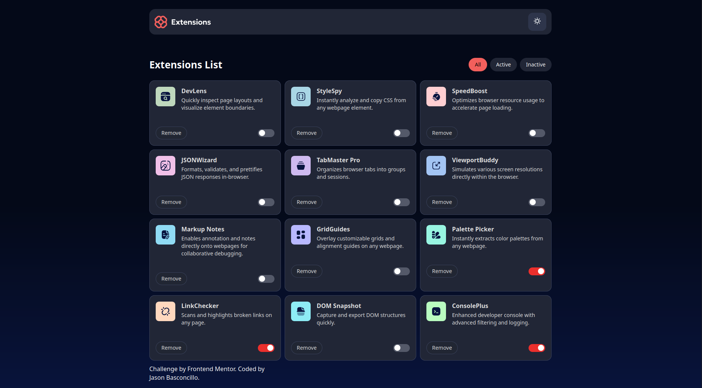
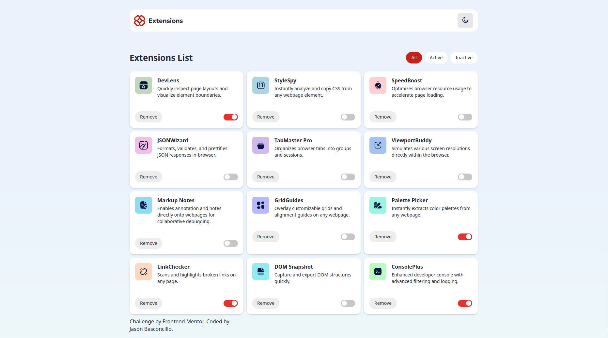

# Frontend Mentor - Browser extensions manager UI solution

This is a solution to the [Browser extensions manager UI challenge on Frontend Mentor](https://www.frontendmentor.io/challenges/browser-extension-manager-ui-yNZnOfsMAp). Frontend Mentor challenges help you improve your coding skills by building realistic projects. 

## Table of contents

- [Overview](#overview)
  - [The challenge](#the-challenge)
  - [Screenshot](#screenshot)
  - [Links](#links)
- [My process](#my-process)
  - [Built with](#built-with)
  - [What I learned](#what-i-learned)
  - [Continued development](#continued-development)
  - [Useful resources](#useful-resources)
- [Author](#author)

**Note: Delete this note and update the table of contents based on what sections you keep.**

## Overview

### The challenge

Users should be able to:

- Toggle extensions between active and inactive states
- Filter active and inactive extensions
- Remove extensions from the list
- Select their color theme
- View the optimal layout for the interface depending on their device's screen size
- See hover and focus states for all interactive elements on the page

### Screenshot

### Links

- Solution URL: [Add solution URL here](https://your-solution-url.com)
- Live Site URL: [Add live site URL here](https://jpbascon.github.io/0.0.1/)

## My process

### Built with

- Semantic HTML5 markup
- CSS custom properties
- Flexbox
- CSS Grid
- JavaScript

**Note: These are just examples. Delete this note and replace the list above with your own choices**

### What I learned

My way of structuring codes has sharpen while working at this project. 

### Continued development

I want to shift my focus on JavaScript mainly on the techniques, the rules, syntax, DOM, and many more. I want to take my
skills to the next level where coding feels like breathing.

## Author

- Website - [Jason Basconcillo](https://jpbascon.github.io/0.0.1/)
- Frontend Mentor - [@jpbascon](https://www.frontendmentor.io/profile/jpbascon)

**Note: Delete this note and add/remove/edit lines above based on what links you'd like to share.**